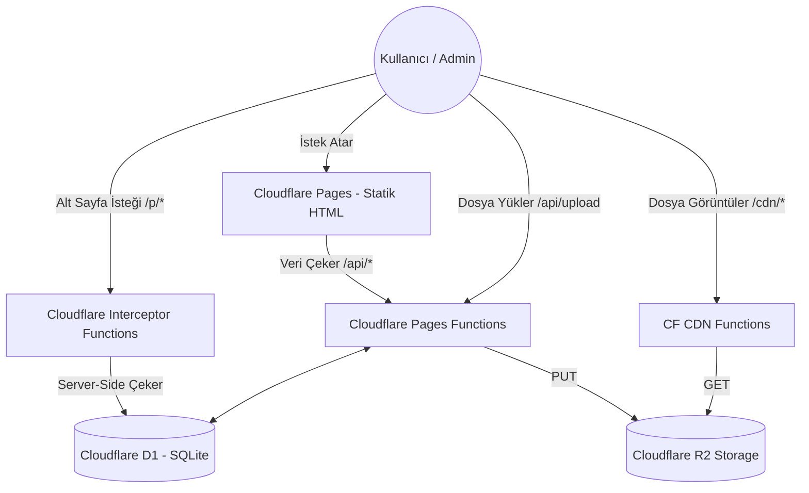

# 🧠 Alper Portfolio & Custom CMS - Project Memory

Bu dosya, projenin başından sonuna kadar geçirdiği tüm evreleri, mimari kararları, veritabanı yapılarını ve özel geliştirilmiş modülleri barındıran **ana hafıza dosyasıdır.** Gelecekte projeye dahil olacak herhangi bir yapay zeka veya geliştirici, bu dosyayı okuyarak saniyeler içinde projeye tam hakimiyet kurabilir.

---

## 🎯 Projenin Amacı
Bu projenin amacı, 3. parti sayfa yapıcılara (Builder.io, Elementor, WordPress vb.) bağımlı kalmadan, **tamamen sıfırdan ve özel olarak kodlanmış bir Sürükle-Bırak CMS (İçerik Yönetim Sistemi)** inşa etmektir. Proje, bulut bilişimin sınırlarında (Edge) çalışacak şekilde Cloudflare ekosistemi üzerinde maksimum hız ve sıfır maliyet mantığıyla tasarlanmıştır.

## 🏗️ Mimari Şema (Architecture)

## 🛠️ Teknoloji Yığını (Tech Stack)
- **Frontend (Arayüz):** Next.js 14 (App Router), React, Tailwind CSS, Lucide React (İkonlar).
- **Frontend Derleme Modeli:** `output: 'export'` (Tamamen Statik HTML).
- **Backend (API):** Cloudflare Pages Functions (`functions/` klasörü altındaki native Cloudflare Worker mantığı). Next.js API'leri uyumsuzluk nedeniyle **kullanılmamıştır.**
- **Veritabanı:** Cloudflare D1 (Edge SQLite). Tüm CMS ayarları, projeler ve dinamik sayfalar JSON string olarak burada tutulur.
- **Medya Deposu:** Cloudflare R2 (AWS S3 alternatifi).

---

## 📜 Kritik Mimari Kararlar (Gelecekteki Geliştirmeler İçin Zorunlu Kurallar)
1. **Next.js Edge API Yok:** Next.js Edge Runtime, Vercel dışında Cloudflare üzerinde çok fazla 500 Internal Server Error veriyordu. Bu yüzden Next.js sadece "Statik Arayüz" olarak kullanıldı. Tüm backend `/functions` klasöründe Cloudflare Native olarak yazıldı.
2. **Hazır Kütüphane Yasak:** Sürükle-bırak tuvali (`CanvasEngine.tsx`) ve blok yapıcı (`BlockRenderer.tsx`) tamamen sıfırdan React Pointer olaylarıyla (`setPointerCapture`) kodlandı. Kendi CMS'imizi yapıyoruz, dışarıdan kütüphane dahil edilmeyecek.
3. **Yüzdesel Koordinatlar:** Serbest tuvaldeki elementlerin X ve Y koordinatları piksel (px) değil, ekranın yüzdesi (`%`) olarak veritabanına kaydedilir. Bu sayede mobilde ve farklı ekranlarda tasarım kırılmaz.

---

## 🚀 Faz Özetleri (Geliştirme Tarihçesi)

### Faz 1 - 5: Temel Kurulum ve Veritabanı
- Next.js projesi oluşturuldu.
- Tailwind CSS ayarlandı.
- Cloudflare D1 veritabanı kuruldu (`alper-cms-db`), tablo yapısı oluşturuldu. İlk API uçları denendi.

### Faz 6 - 14: Mimari Değişim ve Statik'e Geçiş
- Başlangıçta 3. parti Builder.io entegrasyonu denendi ancak kullanıcı isteğiyle reddedildi. Kendi sistemimizi yazma kararı alındı.
- Vercel CLI tabanlı `@cloudflare/next-on-pages` kütüphanesi çökmelere sebep olduğu için projeden tamamen söküldü.
- Next.js `export` moduna alındı, saf Cloudflare Functions mimarisi kuruldu. API 500 hataları kesin olarak çözüldü.

### Faz 15 - 16: Dinamik Sayfa Motoru (Dynamic Pages)
- Kullanıcının dilediği kadar limitsiz alt sayfa oluşturabilmesi için `/p/[[slug]].ts` adında Cloudflare Interceptor yazıldı.
- Alt sayfalar statik olarak derlenmiş tek bir React bileşeni (`src/app/p/page.tsx`) üzerinden veritabanından JSON çekerek dinamik render edilecek şekilde ayarlandı.

### Faz 17 - 20: Kendi Sürükle-Bırak Motorumuz (Canvas Engine)
- Figma/Paint benzeri özgür konumlandırma sunan `CanvasEngine.tsx` yazıldı.
- Metin, Buton, Şekil, Resim ve Sosyal medya eklentileri sisteme tanıtıldı.
- Tıklama taşması (Event Bubbling) bug'ı tespit edildi ve `stopPropagation` ile çözüldü.

### Faz 21 - 25: Cloudflare R2 Medya Sunucusu ve Profesyonel UI
- `wrangler.toml` üzerinden R2 Bucket (Depo) bağlantısı yapıldı.
- Sisteme `/api/upload` ve CDN okuması için `/cdn/[[path]].ts` uçları eklendi.
- Admin paneline devasa bir "Medya Yöneticisi" Modal'ı entegre edildi (Küçük resimler, tek tıkla kopyalama, çöp kutusu ile silme).
- Tarayıcının çirkin uyarı pencereleri (`alert`/`confirm`), projeye özel animasyonlu Toast ve Confirm modalları ile değiştirildi.
- Düz çizgi (Line) ve Özel Logolu Sınırsız Sosyal Medya araçları sisteme dahil edildi.

---

## 🗺️ Sonraki Adımlar (Yol Haritası)
- Yeni Canvas/Blok bileşenlerinin eklenmesi (Video oynatıcı vb.).
- SEO optimizasyonları ve dinamik sitemap/meta etiket yönetimi.
- Kullanıcı etkileşim analizleri.

*(Tarih: Eylül 2026)*
