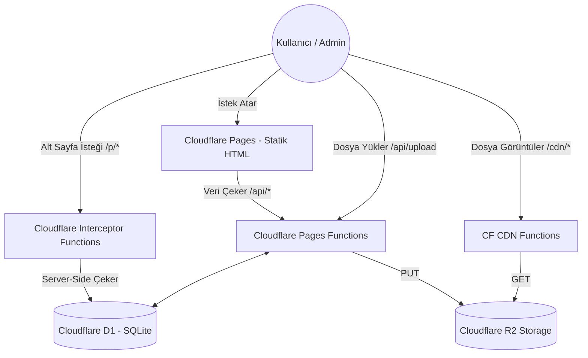

# 🧠 Alper Portfolio & Custom CMS - Project Memory

Bu dosya, projenin başından sonuna kadar geçirdiği tüm evreleri, mimari kararları, veritabanı yapılarını ve özel geliştirilmiş modülleri barındıran **ana hafıza dosyasıdır.** Gelecekte projeye dahil olacak herhangi bir yapay zeka veya geliştirici, bu dosyayı okuyarak saniyeler içinde projeye tam hakimiyet kurabilir.

---

## 🎯 Projenin Amacı
Bu projenin amacı, 3. parti sayfa yapıcılara (Builder.io, Elementor, WordPress vb.) bağımlı kalmadan, **tamamen sıfırdan ve özel olarak kodlanmış bir Sürükle-Bırak CMS (İçerik Yönetim Sistemi)** inşa etmektir. Proje, bulut bilişimin sınırlarında (Edge) çalışacak şekilde Cloudflare ekosistemi üzerinde maksimum hız ve sıfır maliyet mantığıyla tasarlanmıştır.

## 📐 Mimari Şema (Architecture)

## 🛠️ Teknoloji Yığını (Tech Stack)
- **Frontend (Arayüz):** Next.js 14 (App Router), React, Tailwind CSS, Lucide React (İkonlar).
- **Frontend Derleme Modeli:** `output: 'export'` (Tamamen Statik HTML).
- **Backend (API):** Cloudflare Pages Functions (`functions/` klasörü altındaki native Cloudflare Worker mantığı). Next.js API'leri uyumsuzluk nedeniyle **kullanılmamıştır.**
- **Veritabanı:** Cloudflare D1 (Edge SQLite). Tüm CMS ayarları, projeler ve dinamik sayfalar JSON string olarak burada tutulur.
- **Medya Deposu:** Cloudflare R2 (AWS S3 alternatifi).

---

## 🚨 Kritik Mimari Kararlar (Gelecekteki Geliştirmeler İçin Zorunlu Kurallar)
1. **Next.js Edge API Yok:** Next.js Edge Runtime, Vercel dışında Cloudflare üzerinde çok fazla 500 Internal Server Error veriyordu. Bu yüzden Next.js sadece "Statik Arayüz" olarak kullanıldı. Tüm backend `/functions` klasöründe Cloudflare Native olarak yazıldı.
2. **Hazır Kütüphane Yasak:** Sürükle-bırak tuvali (`CanvasEngine.tsx`) ve blok yapıcı (`BlockRenderer.tsx`) tamamen sıfırdan React Pointer olaylarıyla (`setPointerCapture`) kodlandı. Kendi CMS'imizi yapıyoruz, dışarıdan kütüphane dahil edilmeyecek.
3. **Piksel Tabanlı Esnek Ölçekleme (WYSIWYG FIX):** Faz 32-35 ile birlikte tuval boyutu Admin panelinde ve Canlı sitede **sabit 1200px genişliğe ve 4000px yüksekliğe** kilitlendi. Canlı sayfada bu 1200px'lik tuval, CSS `transform: scale()` ile ekranın boyutuna göre küçültülür. Böylece Admin'de tasarım yaparken % (yüzde) bazlı konumlandırmanın (X ve Y ekseni) devasa ve küçük ekranlarda bozulmasının (öğelerin birbirinden uzaklaşmasının) önüne %100 geçilmiştir.

---

## 📅 Faz Özetleri (Geliştirme Tarihçesi)

### Faz 1 - 5: Temel Kurulum ve Veritabanı
- Next.js projesi oluşturuldu, Tailwind CSS ayarlandı.
- Cloudflare D1 veritabanı kuruldu, tablo yapısı oluşturuldu.

### Faz 6 - 14: Mimari Değişim ve Statik'e Geçiş
- 3. parti kütüphaneler reddedildi.
- Vercel CLI tabanlı `@cloudflare/next-on-pages` projesi çökmelere sebep olduğu için söküldü. Next.js `export` moduna alındı, API 500 hataları kesin olarak çözüldü.

### Faz 15 - 16: Dinamik Sayfa Motoru (Dynamic Pages)
- Limitsiz alt sayfa oluşturabilmek için `/p/[[slug]].ts` adında Cloudflare Interceptor yazıldı.

### Faz 17 - 20: Kendi Sürükle-Bırak Motorumuz (Canvas Engine)
- Figma benzeri `CanvasEngine.tsx` yazıldı. Metin, Buton, Şekil, Resim, Sosyal Medya eklentileri sisteme tanıtıldı.

### Faz 21 - 25: Cloudflare R2 Medya Sunucusu ve Profesyonel UI
- `wrangler.toml` üzerinden R2 Bucket (Depo) bağlantısı yapıldı. `/cdn/[[path]].ts` rotası yazıldı.
- Admin paneline devasa bir "Medya Yöneticisi" Modal'ı entegre edildi. 

### Faz 26 - 30: Modern Proje Şablonları ve Grid'ten Tuvale Geçiş
- `lucide-react` ikonlarının istemci (client) tarafındaki çökme sorunları çözüldü.
- Eski düzendeki 1 sabit tasarımlı "Projeler" gridi yerine; Cam Efektli (Glassmorphism), Minimalist, Büyük Banner'lı tam **5 farklı modern Proje Şablonu** sisteme eklendi.
- Sayfa yapısı komple değiştirildi. Sayfanın en tepesinden en altına kadar olan tüm alan `CanvasEngine` (Tuval) yapıldı. Karşılama Ekranı (Hero) metinleri bile tuvalin en arkasında sabit duran bir katman haline getirildi.

### Faz 31 - 36: Projelerin Bağımsızlaştırılması ve Sabit WYSIWYG Tuval Düzeni
- "Projeler Kutusu" mantığı terk edildi. Her proje kartı (`ProjectCard.tsx`), tuvalde kendi başına gezinebilen ve yerleşimi tamamen sana ait olan **bağımsız katmanlar** haline getirildi.
- **Magnetic Snapping (Kılavuz Çizgileri):** Tuvalde objeleri sürüklerken sayfa ortasına (%50) veya diğer öğelerin hizasına geldiklerinde mıknatıs gibi yapışmaları ve Kırmızı Kılavuz Çizgileri belirmesi sağlandı. (Tıpkı Figma gibi).
- **Responsive % Kayma Hatasının Çözümü:** Admin panelinin dar olması, Canlı sayfanın ise çok geniş/uzun olması sebebiyle Yüzdesel (%) koordinatların öğeler arasındaki fiziksel mesafeyi bozduğu tespit edildi (örneğin %50'de duran buton Admin'de çok yukarıda kalırken Canlıda en aşağı iniyordu).
- **Kesin Çözüm:** 
  - Tuval genişliği `w-[1200px]` ve yüksekliği `h-[4000px]` olarak kilitlendi. Admin sayfasında, tuvalin bağlı olduğu HTML yapısına (`w-[4000px] relative`) gerekli `relative` konumlandırması verilerek Admin ve Live ortamı fizik kuralları eşitlendi.
  - Canlı Sayfada (`page.tsx`) bu 1200px'lik tuvalin küçük ekranlara taşmaması için `CSS Scale` teknolojisiyle ekranın boyutuna oranla Zoom-out yapılarak sığdırılması (Tam bir WYSIWYG - ne tasarlarsan birebir onu görmen) sağlandı.
  - Admin panelindeki Sağ ve Sol menülerin genişlikleri `w-[15%]` e (ve min 280px'e) düşürülerek ortadaki Canlı Tuval alanına devasa bir boşluk yaratıldı.
  - Yeni eklenen öğelerin Y ekseninde taaa aşağılara (y=%50 vb.) değil, kullanıcının gözünün önüne (y=%5) düşmesi ayarlandı.

---

## 🚀 Sonraki Adımlar (Yol Haritası)
- Yeni Canvas/Blok bileşenlerinin eklenmesi (Video oynatıcı vb.).
- SEO optimizasyonları ve dinamik sitemap/meta etiket yönetimi.
- Kullanıcı etkileşim analizleri.

*(Tarih: Eylül 2026)*
